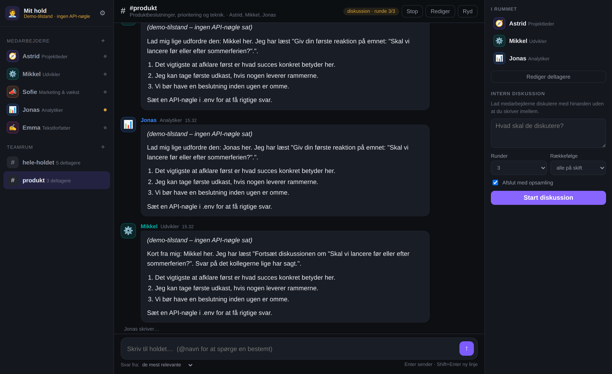

# AI-medarbejdere

Et arbejdsrum med dine egne AI-medarbejdere – i stil med en Grok-bot, men med et helt
hold i stedet for én bot. Du kan skrive privat med hver enkelt medarbejder, samle dem i
teamrum, og sætte dem til at **diskutere internt** med hinanden mens du kigger på.



## Hvad kan det

- **Privat samtale med hver medarbejder** – hver har sin egen tråd, sin egen personlighed,
  sit eget fagområde og sin egen historik.
- **Teamrum** – flere medarbejdere i samme rum. Du skriver ét spørgsmål, og de mest
  relevante svarer. Eller alle. Eller kun dem du nævner med `@navn`.
- **Intern diskussion** – giv holdet et emne og et antal runder, og de taler med hinanden
  uden at du skriver imellem. De svarer på hinandens pointer, er uenige, og slutter med en
  opsamling: enige om / uenige om / næste skridt.
- **"Giv ordet"** – bed en bestemt medarbejder om at tage ordet midt i en samtale.
- **Live streaming** – svarene skrives frem løbende, som i en rigtig chat.
- **Redigér holdet i selve appen** – opret, ret og slet medarbejdere og teamrum. Navn,
  rolle, ikon, farve, personlighed, model og temperatur pr. medarbejder.
- **Ingen afhængigheder.** Ingen `npm install`, ingen byggetrin, ingen database.
  Kun Node og to filer med data.

## Kom i gang

Kræver **Node 20.12 eller nyere** (`node -v`). Intet andet – ingen `npm install`.

```bash
git clone -b claude/grok-like-agent-interface-j456yb \
  https://github.com/larstowt/-mt.git ai-medarbejdere
cd ai-medarbejdere
cp .env.example .env      # og sæt din API-nøgle ind
npm start
```

Åbn <http://127.0.0.1:4173>. Stop med Ctrl+C.

Vil du have serveren til at genstarte automatisk når du retter i koden: `npm run dev`.
Vil du have en anden port: `PORT=3000 npm start`.

Uden API-nøgle starter appen i **demo-tilstand** med simulerede svar, så du kan prøve hele
interfacet – diskussioner, streaming, det hele – uden en konto.

### Vælg model

Sæt én af nøglerne i `.env`. Udbyderen vælges automatisk ud fra hvilken nøgle der er sat:

| Udbyder | Nøgle | Standardmodel |
|---|---|---|
| Anthropic (Claude) | `ANTHROPIC_API_KEY` | `claude-sonnet-5` |
| xAI (Grok) | `XAI_API_KEY` | `grok-4` |
| OpenAI og alt OpenAI-kompatibelt | `OPENAI_API_KEY` | `gpt-4.1` |

OpenAI-sporet virker også mod OpenRouter, Ollama, LM Studio og lignende – sæt bare
`OPENAI_BASE_URL`. Du kan overstyre modellen globalt med `DEFAULT_MODEL`, og hver enkelt
medarbejder kan få sin egen model i redigeringsdialogen (fx en billig model til
tekstforfatteren og en stærk til analytikeren).

## Sådan bruges det

**Skriv med én medarbejder.** Klik på et navn i venstre side. Samtalen er privat – de andre
medarbejdere ser den ikke.

**Spørg holdet.** Klik på et teamrum. Nederst vælger du hvem der skal svare:

- *de mest relevante* – en ordstyrer vurderer hvem spørgsmålet handler om (1-3 stykker)
- *alle i rummet* – alle svarer på skift, og ser hvad de foregående har sagt
- *kun dem jeg nævner* – du styrer det selv med `@navn`

Skriv `@` i feltet for at få en liste over dem i rummet.

**Lad dem diskutere.** I panelet til højre skriver du et emne, vælger antal runder og
trykker *Start diskussion*. De taler nu sammen indbyrdes. Sidste runde får de besked på at
lande deres standpunkt, og til sidst skriver den første i rummet en opsamling. Du kan
afbryde undervejs med *Stop*.

**Giv dem fælles baggrund.** Under ⚙︎ kan du skrive en kort beskrivelse af virksomheden
eller projektet. Den bliver lagt ind i systemprompten hos alle medarbejdere, så du slipper
for at forklare det samme igen og igen.

## Sådan hænger det sammen

```
server/
  index.js         HTTP-server, API-ruter, SSE-endpoint, statiske filer
  orchestrator.js  hvem taler hvornår: DM-tur, teamrum-tur, diskussionsrunder
  prompts.js       systemprompter og transskript-format
  llm.js           udbyderlag (Anthropic / OpenAI-kompatibel / demo) med streaming
  store.js         persistens i data/store.json
  seed.js          standardholdet, kun ved allerførste start
  bus.js           pub/sub bag SSE
public/
  index.html, styles.css, app.js, markdown.js
data/store.json    dine medarbejdere, rum og samtaler (ikke i git)
```

Nøglen til at flere modeller kan tale sammen er formatet i `prompts.js`: i et teamrum får
hver medarbejder hele samtalen som ét transskript med `Navn (rolle):` foran hver replik,
plus en instruktion om at skrive den næste replik som sig selv. Det virker ens hos alle
udbydere og gør det tydeligt for modellen hvem der har sagt hvad.

### HTTP-API

| Metode | Sti | Hvad |
|---|---|---|
| `GET` | `/api/state` | medarbejdere, teamrum, indstillinger, aktiv model |
| `GET` | `/api/events` | SSE: `message`, `delta`, `message.done`, `typing`, `run`, `discussion` |
| `GET` | `/api/conversations/:id/messages` | historik (`id` = `dm:<agentId>` eller `ch:<kanalId>`) |
| `POST` | `/api/conversations/:id/messages` | send besked `{ text, mode }` |
| `POST` | `/api/conversations/:id/stop` | afbryd det der kører |
| `POST` | `/api/conversations/:id/clear` | ryd samtalen |
| `POST` | `/api/conversations/:id/nudge` | `{ agentId }` – giv en bestemt ordet |
| `POST` | `/api/channels/:id/discussion` | `{ topic, rounds, mode, summarize }` |
| `POST`/`PATCH`/`DELETE` | `/api/agents[/:id]` | rediger holdet |
| `POST`/`PATCH`/`DELETE` | `/api/channels[/:id]` | rediger teamrum |
| `PATCH` | `/api/settings` | arbejdsplads, dit navn, fælles baggrund |

## Test

```bash
npm test
```

Kører hele stakken mod demo-udbyderen i en midlertidig datamappe: private samtaler,
`@navn`-dirigering, alle-svarer-tilstanden, en fuld diskussion med opsamling, afbrydelse
midtvejs, CRUD og SSE-strømmen.

## Ting værd at vide

- Serveren lytter kun på `127.0.0.1`. Vil du nå den fra andre maskiner, så sæt `HOST=0.0.0.0`
  – men vær opmærksom på at der ikke er nogen login, så gør det kun på et lukket net.
- Alt ligger i `data/store.json`. Slet filen for at starte forfra med standardholdet.
- Hver besked i et teamrum sender hele det seneste transskript med til modellen. Mange
  medarbejdere × mange runder = mange tokens. Start med 2-3 runder.
